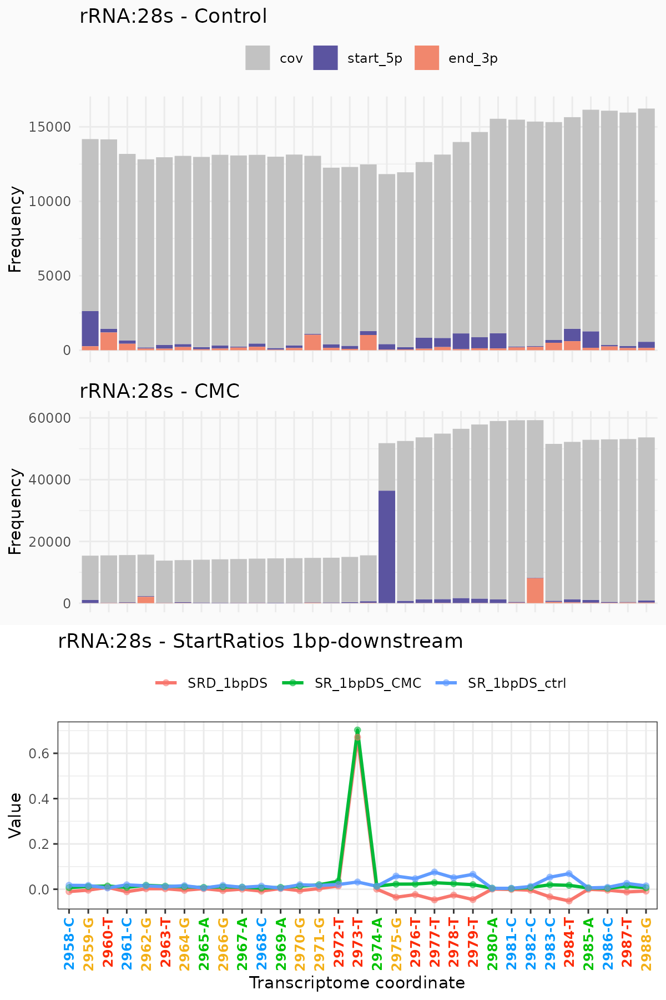
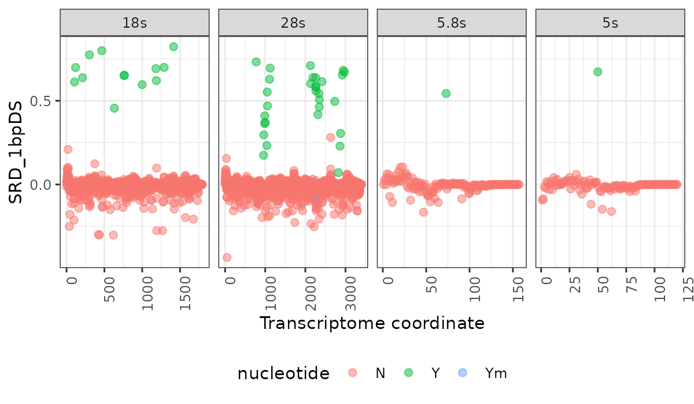
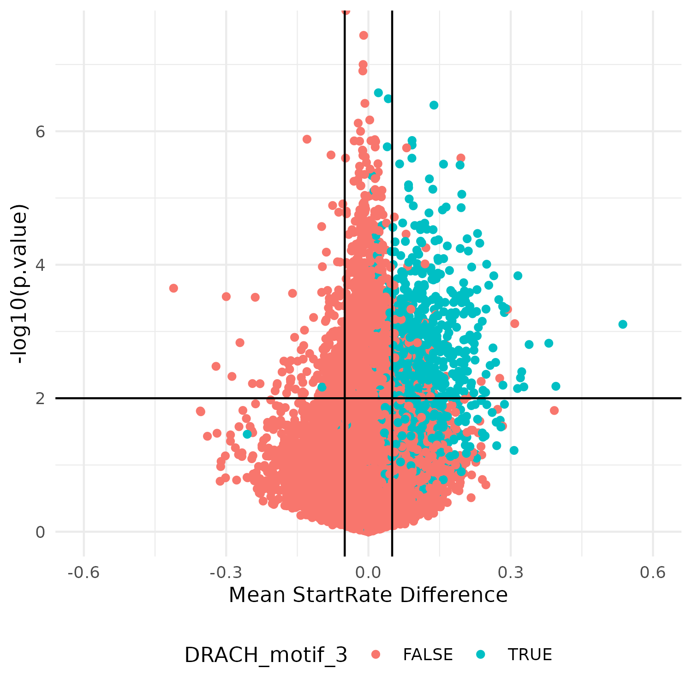
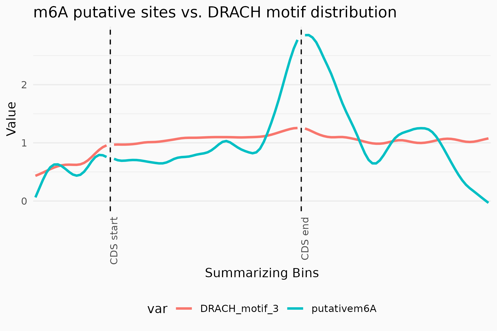
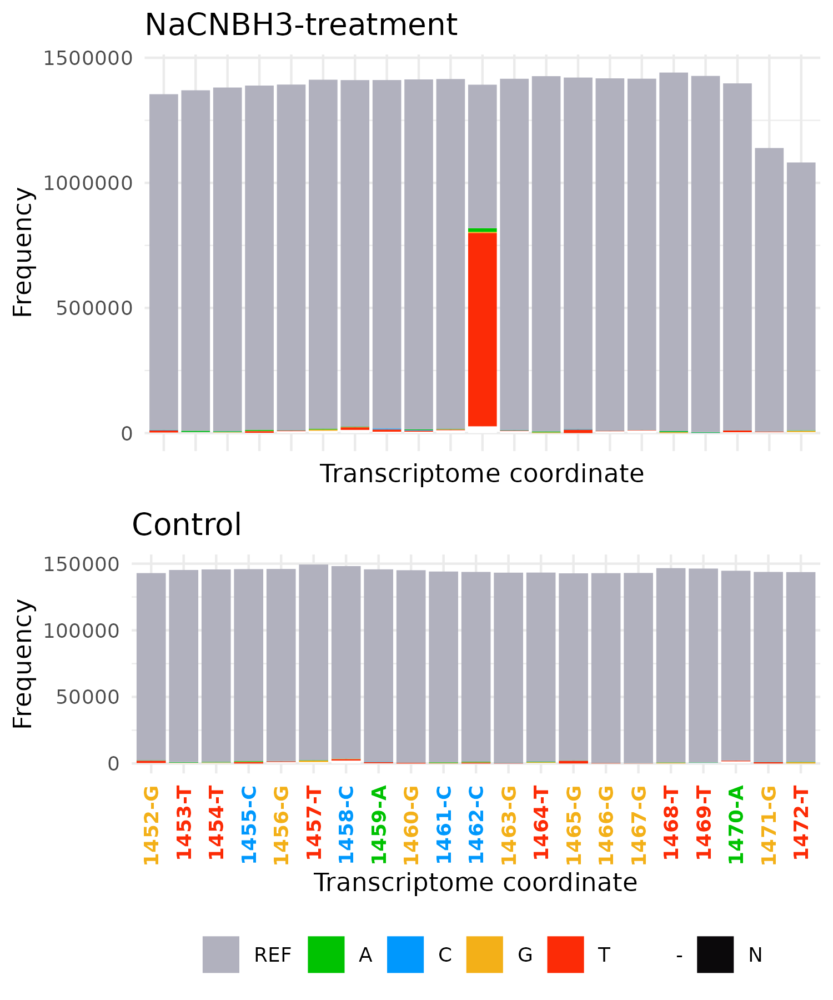
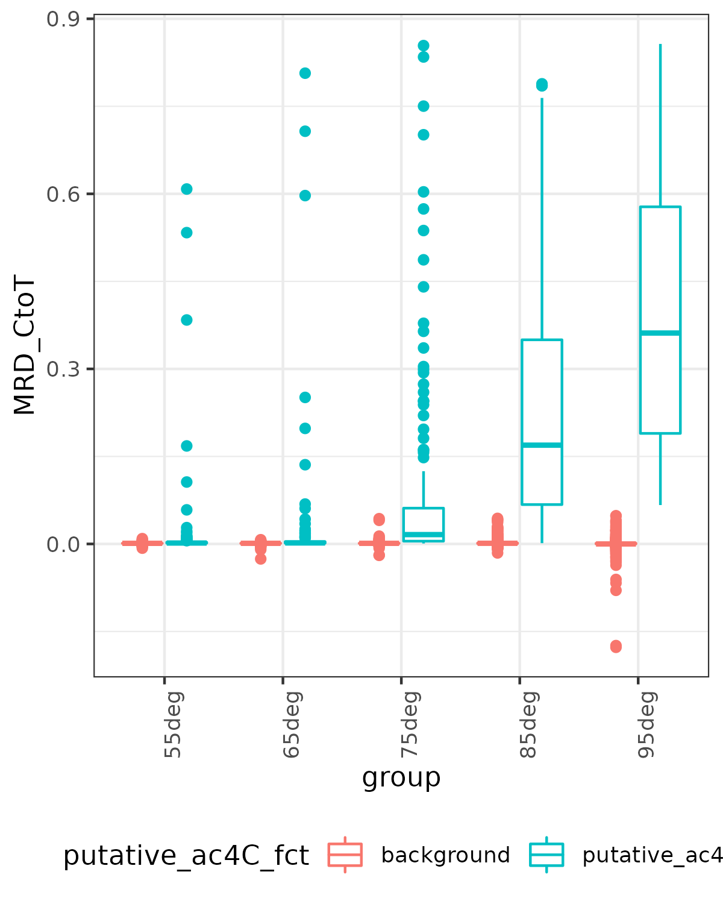
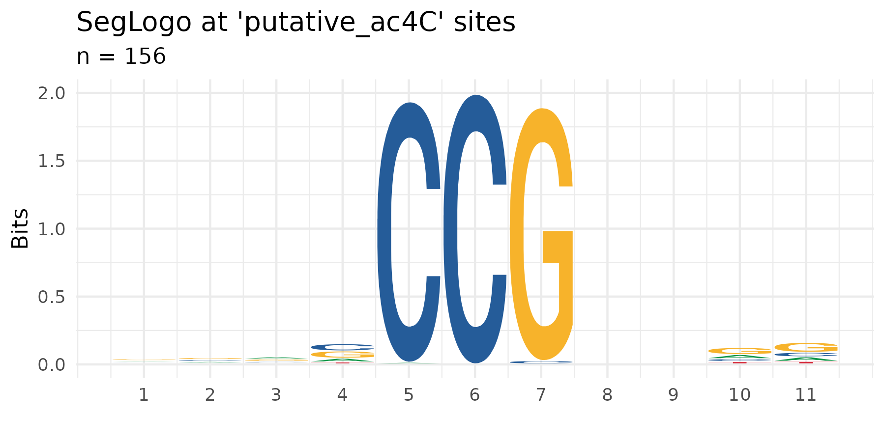

txtools use cases - Abridged version
================
Miguel A. García-Campos
2023-08-25

-   <a href="#1-background" id="toc-1-background">1 Background</a>
-   <a href="#setup" id="toc-setup">2 Setup</a>
-   <a href="#3-use-case-1-pseudouridine-in-yeast-rrna-carlile-et-al-2014"
    id="toc-3-use-case-1-pseudouridine-in-yeast-rrna-carlile-et-al-2014">3
    Use case #1. Pseudouridine in yeast rRNA (Carlile et al., 2014)</a>
-   <a href="#4-use-case-2-m6a-miclip2-in-mesc-körtel-et-al-2021"
    id="toc-4-use-case-2-m6a-miclip2-in-mesc-körtel-et-al-2021">4 Use case
    #2. m6A miCLIP2 in mESC (Körtel et al., 2021)</a>
-   <a
    href="#5-use-case-3-ac4c-in-the-archea-t-kodakarensis-sas-chen-et-al-2020"
    id="toc-5-use-case-3-ac4c-in-the-archea-t-kodakarensis-sas-chen-et-al-2020">5
    Use case #3. ac4C in the archea T. kodakarensis (Sas-Chen et al.,
    2020)</a>
-   <a href="#6-references" id="toc-6-references">6 References</a>
-   <a href="#7-session-info" id="toc-7-session-info">7 Session Info</a>

# 1 Background

[***txtools***](https://github.com/AngelCampos/txtools) is an R package
that enables the processing, analysis, and visualization of RNA-seq data
at the nucleotide-level resolution, seamlessly integrating alignments to
the genome with transcriptomic representation. txtools’ main inputs are
BAM files and a transcriptome annotation, and the main output is a
table, capturing mismatches, deletions, and the number of reads
beginning and ending at each nucleotide in the transcriptomic space.
txtools further facilitates downstream visualization and analyses. We
showcase, using examples from the epitranscriptomic field, how a few
calls to txtools functions can yield insightful and ready-to-publish
results. txtools is of broad utility also in the context of structural
mapping and RNA:protein interaction mapping. By providing a simple and
intuitive framework, we believe that txtools will be a useful and
convenient tool and pave the path for future discovery. txtools is
available for installation from its GitHub repository at:
<https://github.com/AngelCampos/txtools>.

To show the functionality of ***txtools*** in real life scenarios we
will use external data as use cases. We use the following studies’s data
and show how to reach some of the main results the original authors did.

> This version of the txtools_useCases code is an abridged version of
> the *full_version* and is meant for a quick overview of the resulting
> data processed by ***txtools***. Only running txtools’ plotting
> functions.

# 2 Setup

## 2.1 Packages

``` r
library("txtools")
# Supplementary packages
library("magrittr") # Pipe operator
library("data.table") # data.table class
library("ggplot2") # Additional plot tweaking
library("gridExtra") # Arrange plots in one panel
```

## 2.2 Global variables

``` r
NCORES <- 8                 # Number of cores for multicore processes.
if(is.null(NCORES)){stop("Please set a number of cores to be used in the NCORES variable at line 59.\n")}
```

## 2.3 Directories

``` r
nDirs <- c("./figs", "./results", "./omicRefs")  
sapply(nDirs[!nDirs %in% list.dirs()], "dir.create") %>% invisible()
```

# 3 Use case \#1. Pseudouridine in yeast rRNA (Carlile et al., 2014)

For the first use case, we analyzed pseudouridine mapping data, acquired
via Pseudo-seq, a method for genome-wide, single-nucleotide resolution
identification of pseudouridine (Carlile et al. 2014). Carlile and
collaborators employed N-cyclohexyl-N′-(2-morpholinoethyl)-carbodiimide
metho-p-toluenesulphonate (CMC) which reacts with pseudouridines
creating an adduct that blocks cDNA’s reverse transcription one
nucleotide downstream to the pseudouridylated site.

The FASTQ data of a CMC-treated sample and a control sample were
downloaded from GEO: GSE58200, and aligned to the yeast ribosome
reference sequence (Taoka et al. 2016).

## 3.1 txtools processing

Below are the steps and txtools functions used to analyze the data.

1.  Load the reference genome with tx_load_genome(), and the gene
    annotation with tx_load_bed().
2.  Loop through the resulting BAM file for loading with tx_load_bam();
    processing into transcriptomic reads with tx_reads(); create a
    summarized txDT with coverage, read-start, and read-ends data;
    calculate the start-ratio 1bp down-stream (SR_1bpDS) with
    tx_add_startRatio1bpDS(); and finally add a position identifier that
    merges gene and transcriptomic position with tx_add_pos().
3.  Join the SR_1bpDSs results into one txDT and subtract the one of the
    control from that of the CMC-treated sample, yielding the start-rate
    difference 1bp down-stream (SRD_1bpDS).
4.  Join with the Taoka RNA modifications table.
5.  Visualize the processed data with tx_plot_staEndCov() and observe
    the effect of CMC treatment on RT premature stoppage at a known
    pseudouridylated site, which manifests as an abrupt increase of
    read-starts compared to the control sample (Figure 1, top, and
    middle panel). a metric that we can use to detect pseudouridines in
    CMC-treatment data.
6.  Plot all the results using the tx_plot_numeric() function to plot
    numeric variables in a txDT along the same windown of the known
    pseudouridylated sites (Figure 1, bottom panel).
7.  Using the resulting txDT and a common call to ggplot2’s scatter
    plot, the results for all four ribosomal transcripts are shown in
    Figure 2.

## 3.2 Download and load processed data

``` r
download.file(url = "https://zenodo.org/record/8278045/files/useCase1.rds", 
              destfile = "results/useCase1.rds")
sc_txDTL <- readRDS("results/useCase1.rds")
```

## 3.3 Results and plots

``` r
gg_Y_1 <- tx_plot_staEndCov(sc_txDTL$control, gene = "28s", show_yLabels = F,
                            txRange = window_around(2973, 15), bar_border = F) +
    ggtitle("rRNA:28s - Control") + theme(legend.position="top") + xlab(NULL)
gg_Y_2 <- tx_plot_staEndCov(sc_txDTL$CMC, gene = "28s", show_yLabels = F,
                            txRange = window_around(2973, 15), bar_border = F) +
    ggtitle("rRNA:28s - CMC") + theme(legend.position="none") + xlab(NULL)
gg_Y_3 <- tx_plot_numeric(DT = sc_txDTL$RES, gene = "28s", txRange = window_around(2973, 15),
                          colVars = c("SRD_1bpDS", "SR_1bpDS_CMC", "SR_1bpDS_ctrl"),
                          plot_type = "lineplot") + ggtitle("rRNA:28s - StartRatios 1bp-downstream")
ggPsiU_1 <- gridExtra::grid.arrange(gg_Y_1, gg_Y_2, gg_Y_3, layout_matrix = matrix(c(1,1,1,2,2,3,3,3), ncol = 1))

ggsave("figs/pseudoU_1.png", ggPsiU_1, width = 6, height = 9, dpi = 200, bg = "gray98")
```



**Figure 1.** Use case \#1 - rRNA pseudouridylation. Top. txtools
Starts-Ends-Coverage plot for the mock-treatment sample centered at
position 2973 of the yeast 28s rRNA, a known pseudouridine site. Middle.
Same plot as above but for the CMC-treated sample. A dramatic difference
in read-starts is evident at 1 bp downstream from the pseudouridylated
site. Bottom. Lineplot showing SR_1bpDS for both CMC and control
treatment and the resulting difference, SRD_1bpDS, at 28s:2973 and
surrounding nucleotides.

Using txtools´ txDT and `ggplot2` we can easily visualize the data per
nucleotide and RNA modification identity according to MS-based
detection.

``` r
# Plot results
ggPsiU_2 <- ggplot(sc_txDTL$RES, aes(x = txcoor, y = SRD_1bpDS, colour = nucleotide)) + 
    geom_point(size = 2, alpha = 0.5) + facet_grid(.~gene, scales = "free_x") + 
    theme_bw() + theme(axis.text.x = element_text(angle = 90, hjust = 1), legend.position = "bottom") +
    xlab("Transcriptome coordinate")
ggsave("figs/pseudoU_2.png", ggPsiU_2, width = 6, height = 3.5, dpi = 200, bg = "gray99")
```



**Figure 2.** Use case \#1 - Scatterplots of full rRNA transcripts
showing the SRD_1bpDS per nucleotide. Marked in green are the known
pseudouridylated sites and marked in blue is the sole 2’-O-methylated
pseudouridine.

The resulting SRD_1bpDS metric shows that a simple threshold can
discriminate between pseudouridine harboring and non-harboring sites on
rRNA.

# 4 Use case \#2. m6A miCLIP2 in mESC (Körtel et al., 2021)

> NOTE: In this version of the txtools_useCases notebook this use case’s
> processed data was subsampled to 350 random genes to reduce running
> time.

For this case study we analyzed the data of the study that presented
miCLIP2 (Körtel et al. 2021), a miCLIP enhancement allowing
antibody-based single-nucleotide resolution mapping of m6A sites,
relying on crosslinking of an antibody to methylated sites (Linder et
al. 2015). Similarly to its predecessor, miCLIP2 relies on premature
termination of reverse transcription during cDNA synthesis at the
cross-linked residue. Data was downloaded from GEO: GSE163500, selecting
for samples of wild-type (WT) and methyltransferase- like 3 (Mettl3)
knockout in mouse embryonic stem cells (mESC).

## 4.1 txtools processing

Below are the steps and txtools functions used to analyze the data.

1.  Load the reference genome with tx_load_genome(), and the gene
    annotation with tx_load_bed().
2.  Process all BAM files by looping through each with:
    1.  tx_load_bam(): Loading the BAM file
    2.  tx_reads(): Processing into transcriptomic reads
    3.  tx_makeDT_coverage(): Processing into a table with summarized
        data on coverage, read-start, and read-ends.
    4.  tx_add_startRatio1bpDS(): Adding the start ratio 1bp down-stream
3.  Unify all the resulting tables with tx_unifyTxDTL(), this is to have
    them share the same transcriptomic coordinates, by selecting the
    intersection of genes in all data tables.
4.  Perform t-tests using the txtools’ inbuilt ‘genefilter’ wrapper
    (Gentleman et al. 2019) tx_test_ttests(), testing for differences in
    startRatio_1bpDS between WT and KO samples both with the
    immunoprecipitation and crosslinking treatment.
5.  Add DRACH motif presence with tx_add_motifPresence().
6.  Plot a volcano plot using a call to ggplot2’s scatterplot,
    color-coding for DRACH presence, and select putative m6A sites at
    mean difference \> 0.05 and p-value \< 0.01 (Figure 3).
7.  Plot a metagene profile using tx_plot_metageneRegions(). (Figure 4)

## 4.2 Download and load processed data

``` r
download.file(url = "https://zenodo.org/record/8278045/files/uc2_geneAnnot.bed",
              destfile = "omicRefs/uc2.geneAnnot.bed") # download gene annotation, required for some plots
download.file(url = "https://zenodo.org/record/8278045/files/useCase2.rds",
              destfile = "results/useCase2.rds")

mm9_geneAnnot <- tx_load_bed("omicRefs/uc2.geneAnnot.bed")
txRES <- readRDS("results/useCase2.rds")
```

## 4.3 Results and plots

``` r
# Volcano plot
gg_m6A1 <- ggplot(na.omit(txRES),
                  aes(x = dm, y = -log10(p.value), colour = DRACH_motif_3)) + 
    geom_point() + 
    geom_vline(xintercept = 0.05, colour = "black") + 
    geom_vline(xintercept = -0.05, colour = "black") + 
    geom_hline(yintercept = -log10(0.01), colour = "black") + 
    xlab("Mean StartRate Difference") + 
    theme_minimal() + theme(legend.position = "bottom") + xlim(c(-0.6, 0.6))
ggplot2::ggsave(gg_m6A1, filename = "figs/m6A_plot1.png", width = 5, height = 5, bg = "white")
```



**Figure 3.** Case study \#2 - m6A epitranscriptome in mESC using
miCLIP2. Volcano plot showing the 1bp-down-stream mean start-rate
difference at each queried position of the transcriptome (x-axis) and
the -log10 p-value, calculated using a t-test (y-axis). Colored in blue
are all sites that are centered in a DRACH motif.

``` r
ggtx_MGR1 <- tx_plot_metageneRegions(txDT = txRES, geneAnnot = mm9_geneAnnot, 
    colVars = c("putativem6A", "DRACH_motif_3"), nBins_5UTR = 20,
    nBins_CDS = 50, nBins_3UTR = 50, spar = 0.5, nCores = NCORES, normalize = TRUE) 
ggtx_MGR1 <- ggtx_MGR1 + ggtitle("m6A putative sites vs. DRACH motif distribution")
ggsave("figs/ggtx_MGR1.png", plot = ggtx_MGR1, width = 6, height = 4, bg = "gray98")
```



**Figure 4.** Case study \#2 - m6A epitranscriptome in mESC using
miCLIP2. Metagene plot aligned at the end of CDS. Showing the relative
abundance of putative m6A sites in blue, compared to the baseline
presence of the DRACH motif in red. Putative sites thresholds used were
startRatio_1bpDS difference \> 0.05, p-value \< 0.01, only considering
adenines.

# 5 Use case \#3. ac4C in the archea T. kodakarensis (Sas-Chen et al., 2020)

For this case study we analyzed RNA acetylation data, acquired via
ac4C-seq, a chemical method for the transcriptome-wide quantitative
mapping of N4-acetylcytidine (ac4C) at single-nucleotide resolution
(Sas-Chen et al. 2020). Sas-Chen and collaborators employed the reaction
of ac4C with sodium cyanoborohydride (NaCNBH3) under acidic conditions,
which leads to C-\>T mutations at acetylated positions (Thomas et al.
2018). A key result in this study was the discovery of an abundance of
acetylation sites on rRNA derived from the hyperthermophilic archaea T.
kodakarensis. Data from GEO: GSE135826 was downloaded and aligned to the
T. kodakarensis genome.

## 5.1 txtools processing

Below are the steps and txtools functions used to analyze the data.

1.  Load the reference genome with tx_load_genome(), and the gene
    annotation with tx_load_bed().
2.  Process the BAM files with the bam2txDT.R script provided along the
    txtools installation, with the parameters “-p TRUE -d covNuc -r 300
    -m 0” to generate a summarized count data table with coverage,
    read-starts, read-ends, nucleotide frequency, and deletion frequency
    information.
3.  Plot a nucleotide frequency plot using the tx_plot_nucFreq()
    function. To observe the high levels of misincorporations of
    cytidines in place of thymines exclusively in the NaCNBH3-treated
    samples (Figure 5).
4.  Calculate the C to T misincorporation rate across every position of
    the reference transcriptome with tx_add_CtoTMR(). and subtract the C
    to T misincorporation between the control and the NaCNBH3 treatment
    samples for each growth temperature to obtain the rate C to T
    misincorporation rate difference (MRD_CtoT).
5.  Call putative ac4C sites if a position in any of the samples
    surpassed a threshold of MRD_CtoT \> 0.005.
6.  Plot a boxplot showing the calculated MRD_CtoT across temperatures
    (Figure 6). The box plot shows how the stoichiometry of ac4C sites
    increases as the temperature of growth increases, reaching the
    highest levels at 95 °C.
7.  Plot a sequence logo with the ggseqlogo wrapper tx_plot_ggseqlogo().
    (Figure 7)

## 5.2 Download and load processed data

``` r
download.file(url = "https://zenodo.org/record/8278045/files/useCase3_dat.rds",
              destfile = "results/useCase3_dat.rds")
download.file(url = "https://zenodo.org/record/8278045/files/useCase3_res.rds",
              destfile = "results/useCase3_res.rds")

txDTL_Tk <- readRDS("results/useCase3_dat.rds")
txRES_tk <- readRDS("results/useCase3_res.rds")
```

## 5.3 Plotting and results

``` r
gene_i <- "Tk_rRNA_23S"; pos_i <- 1462
gg_Tk1 <- tx_plot_nucFreq(txDTL_Tk$NaCNBH3_85deg, 
                          gene = gene_i, txRange = window_around(pos_i, 10),
                          bar_border = F, show_yLabels = F) +
    theme(legend.position = "none") + ggtitle("NaCNBH3-treatment")
gg_Tk2 <- tx_plot_nucFreq(txDTL_Tk$mock_85deg, 
                          gene = gene_i, txRange = window_around(pos_i, 10),
                          bar_border = F) + ggtitle("Control")

ggsave(filename = "figs/tk_plot_1.png",
       gridExtra::grid.arrange(gg_Tk1, gg_Tk2, ncol = 1), height = 6, width = 5)
```



**Figure 5.** Case study \# 3 - Dynamic RNA acetylation in T.
kodakarensis’ across a temperature gradient. txtools’ nucleotide
frequency plot.

``` r
longDT <- tidyr::pivot_longer(txRES_tk, cols = 7:11, names_to = "group", 
                              values_to = "MRD_CtoT")
gg_tk3 <- ggplot(longDT) + 
    geom_boxplot(aes(x = group, y = MRD_CtoT, colour = putative_ac4C_fct)) +
    theme_bw() + theme(axis.text.x = element_text(angle = 90, hjust = 1)) + 
    theme(legend.position = "bottom") 
ggsave(filename = "figs/boxplot_tk.png", gg_tk3, height = 5, width = 4, bg = "white")
```



**Figure 6.** Case study \# 3 - Dynamic RNA acetylation in T.
kodakarensis’ across a temperature gradient. Boxplot of MRD_CtoT at
putative ac4C sites at increasing growth temperatures.

``` r
gg_tk4 <- tx_plot_ggseqlogo(txRES_tk, "putative_ac4C", upFlank = 5, doFlank = 5)
ggsave(filename = "figs/seqlogo_tk.png", gg_tk4, height = 3, width = 6, bg = "white")
```



**Figure 7.** Case study \# 3 - Dynamic RNA acetylation in T.
kodakarensis’ across a temperature gradient. Sequence logo at detected
putative acetylated sites

# 6 References

``` r
download.file("https://zenodo.org/record/8278410/files/txtools_uc.bib", "txtools_uc.bib")
```

<div id="refs" class="references csl-bib-body hanging-indent">

<div id="ref-Carlile2014-ve" class="csl-entry">

Carlile, Thomas M, Maria F Rojas-Duran, Boris Zinshteyn, Hakyung Shin,
Kristen M Bartoli, and Wendy V Gilbert. 2014. “Pseudouridine Profiling
Reveals Regulated <span class="nocase">mRNA</span> Pseudouridylation in
Yeast and Human Cells.” *Nature* 515 (7525): 143–46.

</div>

<div id="ref-Gentleman2019-ch" class="csl-entry">

Gentleman, Robert, V Carey, Wolfgang Huber, Florian Hahne, and
Maintainer Bioconductor Package Maintainer. 2019. “Package
‘Genefilter’.”

</div>

<div id="ref-Kortel2021-nn" class="csl-entry">

Körtel, Nadine, Cornelia Rücklé, You Zhou, Anke Busch, Peter Hoch-Kraft,
F X Reymond Sutandy, Jacob Haase, et al. 2021. “Deep and Accurate
Detection of m6A RNA Modifications Using <span
class="nocase">miCLIP2</span> and m6Aboost Machine Learning.” *Nucleic
Acids Res.* 49 (16): e92.

</div>

<div id="ref-Linder2015-yi" class="csl-entry">

Linder, Bastian, Anya V Grozhik, Anthony O Olarerin-George, Cem Meydan,
Christopher E Mason, and Samie R Jaffrey. 2015.
“Single-Nucleotide-Resolution Mapping of m6A and m6Am Throughout the
Transcriptome.” *Nat. Methods* 12 (8): 767–72.

</div>

<div id="ref-Sas-Chen2020-px" class="csl-entry">

Sas-Chen, Aldema, Justin M Thomas, Donna Matzov, Masato Taoka, Kellie D
Nance, Ronit Nir, Keri M Bryson, et al. 2020. “Dynamic RNA Acetylation
Revealed by Quantitative Cross-Evolutionary Mapping.” *Nature* 583
(7817): 638–43.

</div>

<div id="ref-Taoka2016-hj" class="csl-entry">

Taoka, Masato, Yuko Nobe, Yuka Yamaki, Yoshio Yamauchi, Hideaki
Ishikawa, Nobuhiro Takahashi, Hiroshi Nakayama, and Toshiaki Isobe.
2016. “The Complete Chemical Structure of Saccharomyces Cerevisiae <span
class="nocase">rRNA</span>: Partial Pseudouridylation of U2345 in 25s
<span class="nocase">rRNA</span> by <span class="nocase">snoRNA</span>
snR9.” *Nucleic Acids Res.* 44 (18): 8951–61.

</div>

<div id="ref-Thomas2018-dh" class="csl-entry">

Thomas, Justin M, Chloe A Briney, Kellie D Nance, Jeffrey E Lopez,
Abigail L Thorpe, Stephen D Fox, Marie-Line Bortolin-Cavaille, et al.
2018. “A Chemical Signature for Cytidine Acetylation in RNA.” *J. Am.
Chem. Soc.* 140 (40): 12667–70.

</div>

</div>

# 7 Session Info

``` r
sessionInfo()
```
